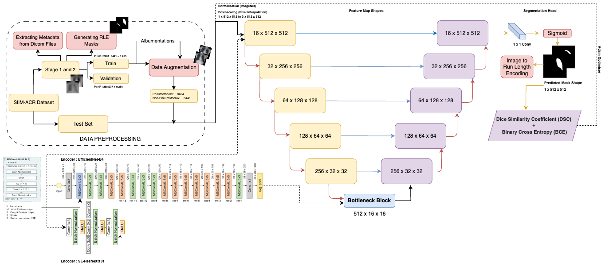
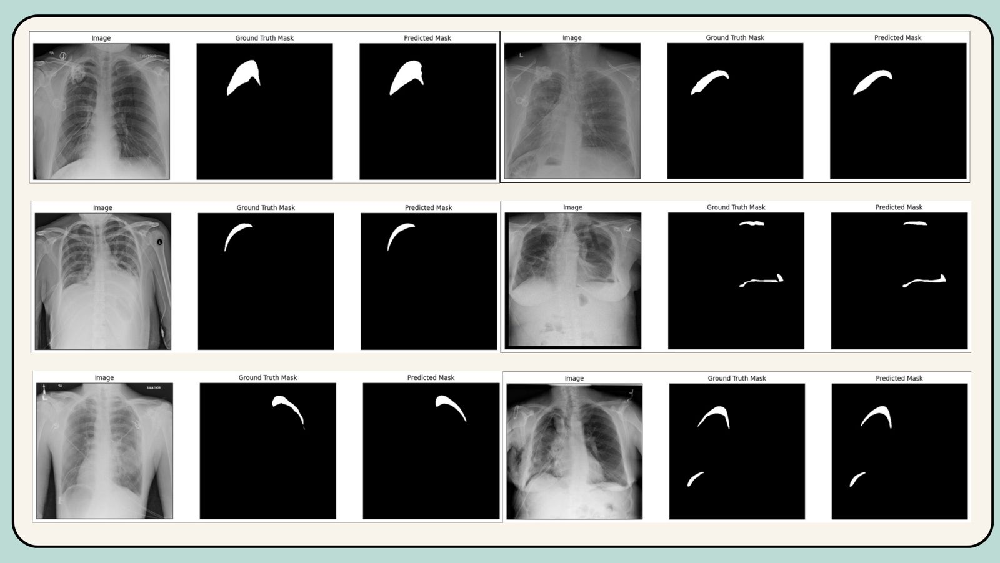

# Pneumothorax Segmentation with Bone Suppression 🫁

Pneumothorax, also known as a collapsed lung, occurs when air leaks into the space between the lung and chest wall. This air pushes on the outside of the lung, causing it to collapse, either partially or completely. Early and accurate detection is crucial for timely treatment. Automated segmentation techniques using deep learning can assist radiologists in identifying and diagnosing pneumothorax from medical images.

**Note: Bone Suppression (the process of removing bones from chest X-Ray images) is applied on the CXRs, and then the below mentioned pipeline is used.** Additionally, you may click [here](https://ai3011.plaksha.edu.in/Spring%202024/PDFs/Ananya%20Shukla.pdf) to see some preliminary intution behind the project. This **slide-deck does NOT contain** our work related to applying bone suppression, our addition of the focal loss to the weighted combo loss, aggressive augmentations, or our improved results.

**Our best model (UNet with the EfficientNet-b7 as the backbone) achieved a Dice Score of 0.8371 on the SIIM-ACR Pneumothorax Segmentation Dataset.**

## Pipeline
Here is the pipeline used for the segmentation task:

## Sample Predictions
Below are some sample predictions made by the segmentation model:

